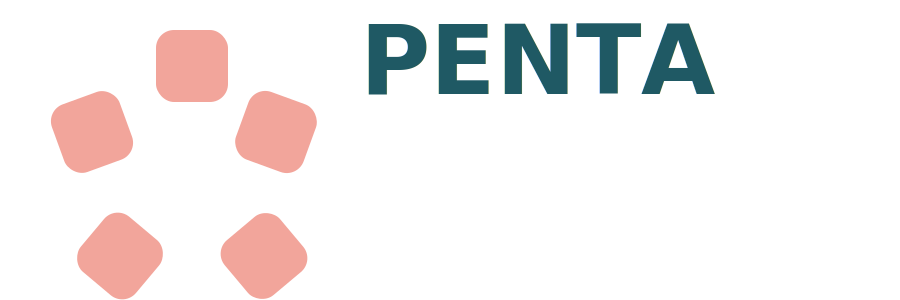

<!-- Banner -->
<p align="center">
  
</p>

<h1 align="center">pentl10n_ec_rrhha_cb_rrhh</h1>
<p align="center">
  Adaptaciones de RRHH para Odoo 18 (Ecuador).
</p>

<p align="center">
  
</p>

---

## 📚 Índice
- [Resumen](#-resumen)
- [Características](#-características)
- [Requisitos](#-requisitos)
- [Instalación](#-instalación)
- [Configuración](#-configuración)
- [Uso](#-uso)
- [Capturas](#-capturas)
- [Roadmap](#-roadmap)
- [Changelog](#-changelog)
- [Tests](#-tests)
- [Licencia](#-licencia)
- [Autor](#-autor)

## 📝 Resumen
Módulo para Odoo 18 Enterprise que añade:
- **Nivel de Educación** configurable (catálogo CRUD).
- **Discapacidad** con tipos parametrizables y subrogación (campos y validaciones).
- **Estado civil** ordenado y traducido: *Soltero(a), Casado(a), Divorciado(a), Viudo(a), Unión de hecho*.
- **Cargas familiares**: modelo, botón desde empleado y **conteo para IR**.

## ✨ Características
- Evita `attrs`/`states` (compatibilidad Odoo 17/18). Se usan **modificadores modernos** y booleanos computados.
- Validador de **cédula ecuatoriana** para subrogado.
- Constraint: **único cónyuge** por empleado.
- Datos precargados de **niveles de educación** y **tipos de discapacidad**.

## 📦 Requisitos
- Odoo 18 Enterprise
- Módulo `hr`

## ⚙️ Instalación
1. Copia `l10n_ec_rrhh` en tu ruta de addons.
2. Reinicia Odoo.
3. Apps → *Actualizar lista* → Instalar **l10n_ec_rrhh**.

> Opcional: en `__manifest__.py` puedes añadir:
> ```python
> "images": ["static/description/icon.svg", "static/description/banner.svg"],
> ```

## 🔧 Configuración
**Empleados → Configuración**
- **Niveles de Educación** (CRUD)
- **Tipos de Discapacidad** (CRUD; incluye “¿Es subrogado?”)

## ▶️ Uso
- En **Empleado**:
  - Selecciona **Nivel de Educación**.
  - En **Discapacidad**, elige un tipo; si “¿Es subrogado?” está activo, verás los campos del subrogado (con validación de cédula).
  - **Cargas familiares**: botón “Cargas familiares”, registrar dependientes y marcar “Usar impuesto a la renta”.  
    El campo **“Cargas familiares para IR”** se calcula automáticamente.

## 🗺️ Roadmap
- [ ] Reglas de validación adicionales por edades en dependientes.
- [ ] Reportes PDF/Excel de cargas familiares.
- [ ] Integración con localización ecuatoriana para RDEP.

## 🧾 Changelog
- **18.0.1.0.0**: Versión inicial (educación, discapacidad con subrogación, cargas familiares, validaciones).

## 🧪 Tests
Ejecuta:
```bash
odoo-bin -d <db> -i l10n_ec_rrhh --test-enable --stop-after-init
